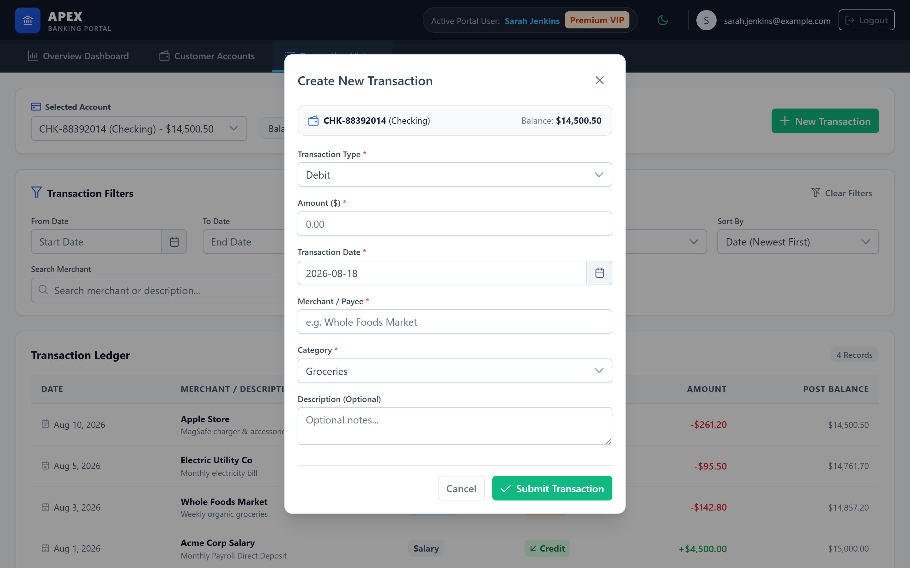
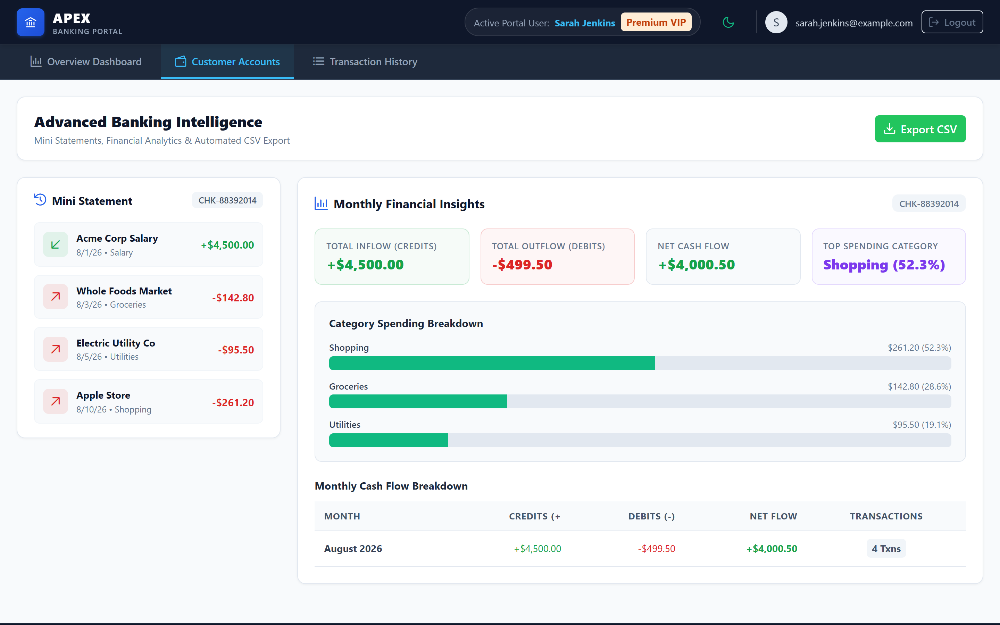

# Banking Portal

[](https://angular.dev/)
[](https://www.typescriptlang.org/)
[](https://primeng.org/)
[](https://rxjs.dev/)
[](https://www.docker.com/)
[](LICENSE)

> An enterprise-grade, modern banking portal built with **Angular 19** standalone architecture and **PrimeNG 19**, featuring interactive customer directory management, account-scoped transaction workflows, custom reactive form validation, financial insights, containerized production deployment, and automated CSV export.

---

## 📋 Deliverables

- **GitHub Repository**: [Hazemfadykalill/Banking_Sector](https://github.com/Hazemfadykalill/Banking_Sector)
- **README Documentation**: [README.md](README.md)
- **Feature List & Technical Assumptions**: [FEATURES.pdf](FEATURES.pdf)
- **Demo Video**: 📹 Demo Video: [https://drive.google.com/file/d/1-cx7SYMAfLOzHyojdlVo9IXiWooFwBQk/view?usp=sharing]

---

> [!NOTE]  
> **Frontend Engineering Assessment Context**  
> This repository was developed as a senior frontend technical assessment. It demonstrates production-quality Angular architecture, state orchestration via Signals, Reactive Form validation, custom RxJS data access layer, accessibility compliance, containerized deployment, and unit testing discipline. All backend data, customer accounts, and authentication sessions are simulated client-side.

---

## 📸 Application Preview

### 1. Authentication & Guarded Access
Enterprise login screen featuring strongly typed Reactive Forms, inline accessibility error messages, and demo account quick-fill options.


---

### 2. Overview Dashboard
Centralized banking dashboard displaying real-time system metrics, customer directory selector, customer profile summary, and customer accounts overview.


---

### 3. Transaction History & Ledger
Account-scoped transaction ledger featuring multi-criteria date range filtering, transaction type / category selectors, merchant text search, sorting, and pagination.


---

### 4. Create Transaction Modal
Interactive modal workflow for creating Debit or Credit transactions with instant balance rule validation, future-date restriction, and immediate optimistic UI updates.



---

### 5. Advanced Financial Intelligence
Mini Statement summary card, monthly cash-flow analytics breakdown, spending category distribution progress bars, and RFC 4180 compliant CSV file export.



---

### 6. Responsive Mobile Experience
Fluid responsive UI ensuring seamless usability across desktop, tablet, and mobile viewports.


---

## ✨ Features Breakdown

### 👤 Customer & Account Management
- **Interactive Directory**: Browse and select from registered banking customers with tier badges (`Premium VIP`, `Platinum`, `Standard`).
- **Profile Summary**: Displays contact information, customer reference ID, registration date, and aggregate portfolio liquid balance.
- **Account Overview**: Tabular view of customer checking, savings, and investment accounts with status badges and currency formatting.

### 🔐 Mock Authentication & Route Security
- **Reactive Login**: Strongly typed form with email, password validation, and whitespace checks.
- **Functional Route Guards**:
  - `authGuard`: Protects internal shell routes (`/dashboard`, `/transactions`, `/accounts`) and redirects unauthenticated visits to `/login` preserving `returnUrl`.
  - `publicGuard`: Redirects authenticated users directly to `/dashboard`.
- **Session Persistence**: Managed via `AuthService` using Angular Signals and safe `localStorage` synchronization.

### 💳 Transaction Management & Validation
- **Account Isolation**: Transaction records are strictly scoped to the active account context.
- **Multi-Criteria Filtering**: Filter by Date Range (`startDate` / `endDate`), Type (`Debit` / `Credit`), Category (`Groceries`, `Bills`, `Income`, etc.), and Merchant text search.
- **Dynamic Sorting & Pagination**: Sort by Date (newest/oldest) or Amount (highest/lowest) with PrimeNG paginator controls.
- **Create Transaction Workflow**:
  - **Type**: Required (`Debit` / `Credit`).
  - **Amount**: Required, `$0.01` to `$100,000.00`, maximum 2 decimal places (`maxDecimalsValidator`).
  - **Date**: Required, past or today only (`pastOrTodayDateValidator`).
  - **Merchant**: Required, 3–50 characters, no whitespace-only (`noWhitespaceValidator`).
  - **Category**: Required dropdown selection.
  - **Debit Balance Business Rule**: `debitBalanceValidator` + `BankingFacadeService.addTransaction` protection prevents over-debiting. If `amount > balance`, transaction creation is rejected with an inline warning without mutating balance.
  - **Optimistic Signal Updates**: Immediately appends new transactions to in-memory state and updates account balance without HTTP re-fetches.

### 📊 Advanced Financial Intelligence & Reporting
- **Mini Statement**: Concise recent ledger summary showing the latest 5 transactions for the selected account.
- **Monthly Analytics**: Groups transactions by calendar month (`YYYY-MM`) calculating Total Credits, Total Debits, Net Cash Flow, and transaction counts.
- **Spending Category Analysis**: Automatically derives top spending categories from Debit transactions with progress percentage indicators.
- **RFC 4180 CSV Export**: Generates and downloads RFC 4180 compliant CSV files (`transactions-{accountNumber}-{date}.csv`) with proper quote/comma escaping, formula injection protection, and Blob resource cleanup.

---

## ⚡ Recent Improvements

### 📐 Schema & Data Alignment
- **Domain Models & Mock Assets**: Aligned Customer and Account models and static JSON mock data with specification requirements (`CIF`, `nationalId`, `segment`, `iban`, and `EGP` currency).

### 💾 State Persistence & Safety
- **localStorage Synchronization**: Customer accounts and transaction state persist seamlessly across page reloads.
- **Schema Version Safeguard**: Added a `SCHEMA_VERSION` safeguard (`v2`) in `BankingFacadeService` to automatically invalidate stale or mismatched `localStorage` data and fall back cleanly to fresh JSON assets.

### 🛡️ Data Integrity & Security
- **Collision-Free UUIDs**: Migrated transaction ID generation to `crypto.randomUUID()` instead of timestamp-based IDs to prevent ID collisions.
- **CSV Formula Injection Defense**: Enhanced `csv-exporter` to prefix leading formula injection trigger characters (`=`, `+`, `-`, `@`, `\t`, `\r`) with a single quote (`'`), neutralizing spreadsheet formula injection while maintaining RFC 4180 compliance.

### ⚡ Performance & Optimization
- **Virtual Scrolling**: Implemented PrimeNG virtual scrolling (`virtualScroll`) on the transaction list component for high-performance rendering of large transaction datasets.
- **Signal Memoization**: Converted component getters to Angular `computed()` signals and `input()` signal inputs across monthly insights, mini statement, transaction filters, and account options to eliminate redundant re-evaluations on change detection.
- **Bundle Budget Tuning**: Adjusted production build warning threshold to `750kB` in `angular.json` after confirming lazy-loading and module imports were already optimized.

### 🧹 Code Quality & Standardization
- **Unused Import Cleanup**: Pruned confirmed-unused PrimeNG module imports (`CardModule`, `ButtonModule`, `DividerModule`, `TagModule`) across presentation components.
- **Unified Currency Formatting**: Standardized currency display to `EGP` across the portal for consistency with account currency data.

---

## 🐳 Dockerization & Container Architecture

The application is fully containerized for production-grade web delivery and local container execution.

### Multi-Stage Production Build Workflow

```text
Build Stage (Node 22 Alpine)
  ├── Copy package.json & package-lock.json
  ├── npm ci (Deterministic dependency installation)
  ├── Copy application source
  └── ng build (Production bundle -> dist/banking-portal/browser)
        │
        ▼
Runtime Stage (Nginx 1.27 Alpine)
  ├── Copy nginx.conf -> /etc/nginx/conf.d/default.conf
  ├── Copy compiled assets -> /usr/share/nginx/html
  ├── Expose Port 80
  └── Serve SPA with route fallback & security headers
        │
        ▼
Local Host Port (http://localhost:8080)
```

The runtime image contains **only** Nginx and the static distribution bundle. No Node.js runtime, development tools, or source dependencies exist in the production image layer.

### Docker Configuration Files

| File | Description / Purpose |
| :--- | :--- |
| [`Dockerfile`](file:///c:/Users/pc2/Downloads/CubicTask/Banking_Sector/Dockerfile) | Multi-stage build (`node:22-alpine` build stage + `nginx:1.27-alpine` runtime stage). |
| [`docker-compose.yml`](file:///c:/Users/pc2/Downloads/CubicTask/Banking_Sector/docker-compose.yml) | Local service definition mapping host port `8080` to container HTTP port `80`. |
| [`nginx.conf`](file:///c:/Users/pc2/Downloads/CubicTask/Banking_Sector/nginx.conf) | Production Nginx web server config supporting SPA route fallback (`try_files`), Gzip compression, static caching, and security headers. |
| [`.dockerignore`](file:///c:/Users/pc2/Downloads/CubicTask/Banking_Sector/.dockerignore) | Excludes `.git`, `node_modules`, `dist`, `.angular`, `.env`, and OS files from build context. |

### Docker Usage Commands

#### Build Container Image
```bash
docker compose build
```

#### Start Container (Detached Mode)
```bash
docker compose up -d
```

#### Inspect Container Status
```bash
docker compose ps
```

#### View Container Logs
```bash
docker compose logs
```

#### Stop & Remove Container
```bash
docker compose down
```

#### Clean Rebuild Without Cache
```bash
docker compose build --no-cache
docker compose up -d
```

### Accessing the Containerized Portal

Once running, access the portal in your web browser at:
```text
http://localhost:8080
```

### Nginx SPA Route Fallback & Security Headers

Nginx is configured to serve the Angular Single Page Application and route all client-side navigation requests to `/index.html`. Direct browser navigation and deep links work out of the box without returning 404 errors:

- `http://localhost:8080/`
- `http://localhost:8080/login`
- `http://localhost:8080/dashboard`
- `http://localhost:8080/accounts`
- `http://localhost:8080/transactions`

Nginx also automatically attaches security response headers:
- `X-Frame-Options: SAMEORIGIN`
- `X-XSS-Protection: 1; mode=block`
- `X-Content-Type-Options: nosniff`
- `Referrer-Policy: strict-origin-when-cross-origin`

### Docker Verification Summary

| Check | Status | Verification Detail |
| :--- | :---: | :--- |
| **Docker Compose Config** | **PASS** | Validated via `docker compose config` |
| **Multi-Stage Docker Build** | **PASS** | `node:22-alpine` build + `nginx:1.27-alpine` runtime |
| **Container Startup** | **PASS** | Active on `http://localhost:8080` |
| **SPA Route Handling** | **PASS** | Direct access to all client routes returned HTTP 200 OK |
| **Static Asset Serving** | **PASS** | Static mock assets (`/assets/mock/*.json`) served cleanly |
| **Nginx Security Headers** | **PASS** | Verified via response headers |
| **Angular Production Build** | **PASS** | `npm run build` generated client distribution bundle |

---

## 🏗️ Architecture & State Flow

```mermaid
flowchart TD
    subgraph Presentation Layer
        DashboardComponent --> CustomerListComponent
        DashboardComponent --> CustomerSummaryComponent
        DashboardComponent --> AccountListComponent
        TransactionsComponent --> TransactionFiltersComponent
        TransactionsComponent --> TransactionListComponent
        TransactionsComponent --> CreateTransactionComponent
        AdvancedComponent --> MiniStatementComponent
        AdvancedComponent --> MonthlyInsightsComponent
    end

    subgraph Application & State Layer
        BankingFacadeService[BankingFacadeService\n(Signals Store & Business Rules)]
        AuthService[AuthService\n(Session Signal & Auth State)]
    end

    subgraph Data Access Layer
        BankingDataService[BankingDataService\n(RxJS shareReplay Caching)]
        MockJSON[public/assets/mock/*.json]
    end

    Presentation Layer -->|Consume Signals & Emit Events| Application & State Layer
    BankingFacadeService -->|Single Fetch HTTP Stream| BankingDataService
    BankingDataService -->|Fetch Assets| MockJSON
```

### 📂 Directory Structure

```text
src/app/
├── core/
│   ├── guards/         # Functional authGuard & publicGuard
│   ├── models/         # Strongly typed domain interfaces (Customer, Account, Transaction)
│   └── services/       # BankingDataService (RxJS caching) & BankingFacadeService (Signals)
│
├── features/
│   ├── auth/           # LoginComponent & Reactive login form
│   ├── dashboard/      # Customer directory, summary & accounts overview
│   ├── transactions/   # Transaction ledger, filters, table & create transaction modal
│   └── advanced/       # Mini statement, monthly analytics & CSV exporter view
│
├── layout/             # Application shell, header & navigation components
├── shared/
│   ├── utils/          # RFC 4180 CSV exporter utility
│   └── validators/     # Custom validators (no-whitespace, max-decimals, debit-balance)
│
└── app.routes.ts       # Standalone lazy-loaded routing configuration
```

---

## 🛠️ Key Engineering Principles

- **Angular 19 Standalone Architecture**: No legacy `NgModule` boilerplate; components, directives, and pipes are 100% standalone.
- **State Facade Pattern**: `BankingFacadeService` provides a unified reactive API exposing readonly signals (`customers`, `selectedAccount`, `customerAccounts`, `selectedAccountTransactions`).
- **Derived State via `computed()`**: Aggregate balances, portfolio totals, filtered transactions, and monthly analytics are calculated reactively via `computed()` signals without redundant state synchronization.
- **RxJS `shareReplay(1)` Caching**: Data access service executes static JSON HTTP fetches exactly once, avoiding duplicate requests during navigation.
- **OnPush Change Detection**: Every presentation component employs `ChangeDetectionStrategy.OnPush` for optimal rendering performance.
- **Isolated Feature Chunks**: Routes are lazy-loaded via `loadComponent()`, keeping initial JavaScript bundles lightweight.

---

## 🚦 Route Security Matrix

| Route | Component | Guard | Description |
|---|---|---|---|
| `/login` | `LoginComponent` | `publicGuard` | Public authentication page; redirects authenticated users to `/dashboard`. |
| `/dashboard` | `DashboardComponent` | `authGuard` | Overview dashboard displaying customer directory and accounts. |
| `/transactions` | `TransactionsComponent` | `authGuard` | Account-scoped transaction ledger with filtering and creation workflows. |
| `/accounts` | `AdvancedComponent` | `authGuard` | Advanced financial intelligence, mini statement, and CSV export. |

---

## 🧪 Testing Discipline

Unit tests are written using **Jasmine** and executed headless via **Karma**:

```bash
npx ng test --watch=false --browsers ChromeHeadless
```

### Test Suite Status

- **Total Executed Specs:** `82`
- **Passed:** `80 SUCCESS`
- **Pre-existing Failures:** `2` (Inherited from PR #3 i18n string assertion expectations on `dev`; independent of Dockerization)

#### Key Areas Tested:
- **Services & Data Layer**: JSON caching, static dataset loading, optimistic transaction creation, balance updates, schema version fallback.
- **Guards & AuthService**: Protected route redirection, returnUrl preservation, authenticated session state.
- **Form & Custom Validation**: Required fields, numeric bounds, maximum 2 decimal places, future date rejection, whitespace rejection, debit amount vs. balance cross-field rules.
- **Transactions & Filtering**: Multi-criteria filtering (date range, type, category, search), sorting by date/amount, pagination state integrity.
- **Advanced Features**: RFC 4180 CSV cell escaping, formula injection protection, Blob file generation, monthly cash flow aggregation, top spending category derivation.

---

## 🚀 Getting Started

### Option A: Running via Docker (Recommended)

1. **Clone the repository:**
   ```bash
   git clone https://github.com/Hazemfadykalill/Banking_Sector.git
   cd Banking_Sector
   ```

2. **Start the container:**
   ```bash
   docker compose up -d
   ```

3. **Navigate to the portal:**
   Open your browser and navigate to `http://localhost:8080/`.

---

### Option B: Local Node.js Development Server

#### Prerequisites
- **Node.js**: `v22.x` (Tested on `v22.16.0`)
- **npm**: `v10.x` (Tested on `v10.9.2`)

#### Installation & Run

1. **Clone the repository:**
   ```bash
   git clone https://github.com/Hazemfadykalill/Banking_Sector.git
   cd Banking_Sector
   ```

2. **Install dependencies:**
   ```bash
   npm install
   ```

3. **Start the local development server:**
   ```bash
   npm start
   ```

4. **Navigate to the portal:**
   Open your browser and navigate to `http://localhost:4200/`.

---

## 🔑 Demo Credentials

For quick evaluation during technical review, use any of the pre-configured mock customer accounts:

| Email | Password | Customer Name | Role / Tier |
|---|---|---|---|
| `sarah.jenkins@example.com` | `Banking2026!` | Sarah Jenkins | Premium VIP |
| `marcus.vance@example.com` | `Banking2026!` | Marcus Vance | Platinum |
| `elena.rostova@example.com` | `Banking2026!` | Elena Rostova | Standard |

*(Note: The mock login service accepts any valid email format with any non-empty password for flexible testing.)*

---

## 📦 Build & Bundle Budget Analysis

To generate the production build:

```bash
npm run build
```

### Build Artifacts Overview
- **Lazy Chunks:**
  - `transactions-component`: `76.09 kB`
  - `login-component`: `32.52 kB`
  - `advanced-component`: `26.83 kB`
  - `dashboard-component`: `24.64 kB`
- **Initial Total Raw Size:** `687.33 kB` (`158.95 kB` estimated transfer size).

> [!NOTE]  
> **Bundle Budget Threshold**  
> The initial build output warning threshold (`maximumWarning`) is set to `750kB` in `angular.json` to accommodate PrimeNG 19 core theme styles (`@primeng/themes/aura`) and `primeicons` webfont assets while keeping all feature modules 100% lazy-loaded.

---

## ⚖️ Limitations & Technical Scope

- **Client-Side Data Layer**: Data persistence occurs client-side via in-memory Signal state and `localStorage` synchronized with schema versioning.
- **Client-Side Authorization**: Authentication is simulated client-side for assessment evaluation without an external OAuth2/OIDC provider.

---

## 📄 License

This project is open-source under the [MIT License](LICENSE).
